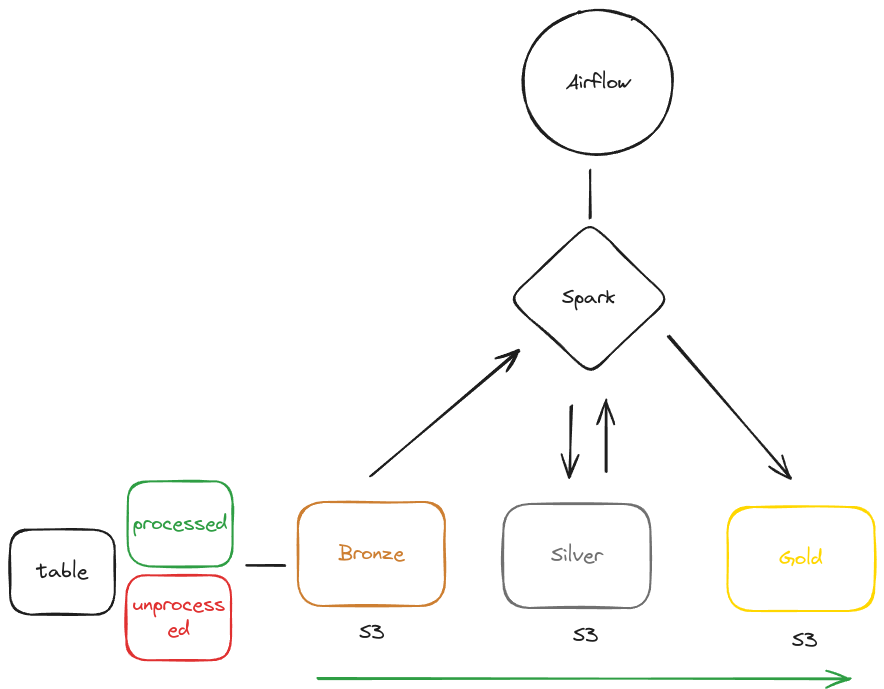
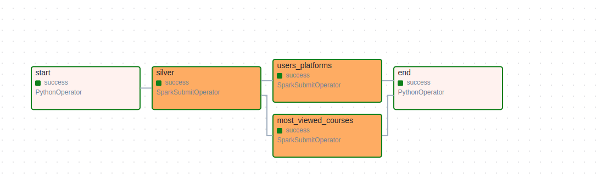
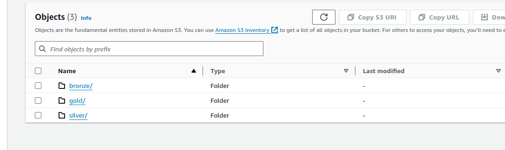

The project is divided into three smaller projects: common, silver, and gold. Each one should be treated as a separate part.

- **common**: Contains utilities or helpers that can be used by the other projects to avoid repeating code.
- **silver**: This is the code related to the silver layer of the data lake.
- **gold**: This is the code related to the gold layer of the data lake.

# Architecture

## Airflow Execution

## S3 Folders

# Common

This project includes functions for reading data, writing data, creating Spark sessions, and any other code that could be useful for both projects. It can be expanded to be used in multiple projects across the company to avoid code repetition, boost productivity, and maintain consistent patterns. In a real-world scenario, it would have its own dedicated Git repository.

# Silver
This project includes functions for processing data in the silver layer. The purpose of the silver layer is to take raw data (such as CSV, JSON, or Parquet files) and write it in a more optimized format. It applies transformations to make the data more query-friendly and efficient. Only simple transformations are performed here, such as casting columns, partitioning tables, and adding useful metadata.

 The silver layer is the foundation for the gold layer, where more complex transformations and aggregations take place.

Delta Lake was chosen as the table format because it supports ACID transactions in the data lake. This means data can be written while another application is reading it, without causing errors or data inconsistencies.

Delta Lake also has built-in features to manage file size, preventing the small file problem. It can physically organize data to make queries faster, supports the merge command to run UPSERT operations on your data, offers data versioning, and more.

The Silver Layer code was designed with scalability in mind, making it easy, simple, and fast to add more tables. To add a new table, you only need to create a new YAML file with some definitions, such as the source path, destination path, primary key, and more. You can find an example in `silver/yaml_config/table_data.yaml`.

The code in the silver layer is highly customizable and can be easily extended to support new data sources or transformations.

The data is processed incrementally, and the folder structure in the Bronze layer (which is the source for the Silver layer) should follow this pattern: `table_name/unprocessed` (where the unprocessed files are stored). After each processing run, the job moves the files from the `unprocessed` folder to the `processed` folder. This way, on the next execution, only the new files in the `unprocessed` folder will be processed, as the Silver layer code only reads from this folder.

## Improvements on the Silver Layer

**Incremental Logic**

The current incremental processing logic is too simple because, after each run, all files in the `unprocessed` folder are moved to the `processed` folder. This means that if new files arrive during the processing, they will also be moved to the `processed` folder and won't be processed in the next run.

To improve this logic, before execution, all the files that will be processed should be mapped. This list of files should then be passed to the reader, and only these specific files should be moved to the `processed` folder. This ensures that any new files arriving during the processing will remain in the `unprocessed` folder and will be picked up in the next run.

**Full Processing**

The current code lacks a mechanism to automatically run a full table processing. If a full processing is needed, all the files must be manually moved from the `processed` folder back to the `unprocessed` folder, which is inefficient and prone to errors.

To address this issue, the code could be enhanced to accept a parameter that indicates when a full processing is needed. With this parameter, the code would automatically read the entire `unprocessed` folder, eliminating the need to manually move the files.

Additionally, in the current setup, the processed files are kept in their original formats. It would be beneficial to implement a process that converts these files into a more efficient format, such as Parquet, and merges smaller files into larger ones. This would improve storage efficiency and performance.

**Unit Tests**

The current code only has unit tests for some functions. These tests should be expanded to cover the entire codebase.

# Gold Layer

This project includes functions for processing data in the gold layer. The gold layer is where more complex transformations and aggregations take place. Business rules are applied to create fact and dimensions to answer the business questions.

The Gold Layer code needs to be more flexible due to the nature of the specific transformations that may be required. While YAML files are still used to store some configurations, as seen in `yaml_config/most_viewed_courses.yaml`, these configurations only cover source and destination paths. Unlike the Silver Layer, no transformations are defined in the YAML files.

In the Gold Layer, the transformations are defined directly in the code, providing greater flexibility and allowing for customization to meet various business rules and requirements. This approach ensures that the code can easily adapt to different transformation needs.

Delta Lake was also chosen as the table format for this layer, allowing us to leverage the same capabilities mentioned in the Silver Layer.

## Improvements on the Gold Layer

**Unit Tests**

The current code lacks unit tests, and they should be added to cover the entire codebase. This will help ensure the reliability and maintainability of the code by catching potential issues early.

**Data Quality Tests**

Data quality tests are crucial to ensure that we are delivering the data as intended, by checking business rules and verifying that the data meets all expectations.

To streamline this process, we can use libraries like [Great Expectations](https://greatexpectations.io/) and [Soda Core](https://github.com/sodadata/soda-core). These tools simplify the creation and maintenance of data quality tests, making it easier to validate and monitor the integrity of the data.

Additionally, it's important to have a Data Quality dashboard to centralize all these checks in one place. This dashboard would allow for monitoring and tracking all data quality checks, ensuring that any issues are quickly identified and addressed.

We can implement data verification using various patterns. One approach is to verify the data during the pipeline execution, ensuring that any issues are caught and addressed in real-time. Alternatively, we can use the well-known write-audit-publish pattern, popularized by Netflix, which involves writing the data, auditing it for quality and correctness, and then publishing it.

You can read more about the write-audit-publish pattern in this [article](https://dagster.io/blog/python-write-audit-publish).

**Deal with more than one source**

The current code is designed to handle only one data source at a time, but Gold Layer pipelines can be much more complex, often involving multiple joins between different datasets. To accommodate this, the code should be expanded to handle multiple data sources as needed, allowing for more complex data transformations and integrations within the pipeline.

**Incremental Processing**

The current code processes the entire table in each execution, which is neither performant nor cost-efficient. To design a more efficient solution, it's important to first understand how often the data will be processed each day and how the data will be grouped.

# Improvements on the entire Architecture

**Security**

The keys to access S3 are currently stored in ENV files because we are accessing S3 from a local machine. However, in a real AWS environment, the best practice is to use IAM roles to manage permissions between AWS services. This approach eliminates the need to store sensitive information like access keys in ENV files. 

If storing keys or other sensitive information is unavoidable, services like AWS Secrets Manager or Parameter Store should be used to securely manage and retrieve these credentials. This enhances security and reduces the risk of exposure.

**Monitoring**

This project currently lacks a monitoring system, which is essential in a real-world scenario. At a minimum, there should be an alert system in place. Since we are using Airflow, it's straightforward to set up notifications that send messages to Slack or Teams if the pipeline fails.

Additionally, having a centralized view, such as a dashboard, to monitor the health of all pipelines is crucial. This dashboard would provide a comprehensive overview, allowing for quick identification of any issues and ensuring that all pipelines are running smoothly.

**Data Catalog**

In a real scenario, having a Data Catalog is important. A Data Catalog facilitates data discovery by providing a centralized repository where users can easily search for and understand available datasets. It also enhances security by allowing more granular control over permissions, ensuring that users only access the data they are authorized to view. 

Additionally, it reduces the need for users to have direct access to the underlying storage, further securing the data environment.
